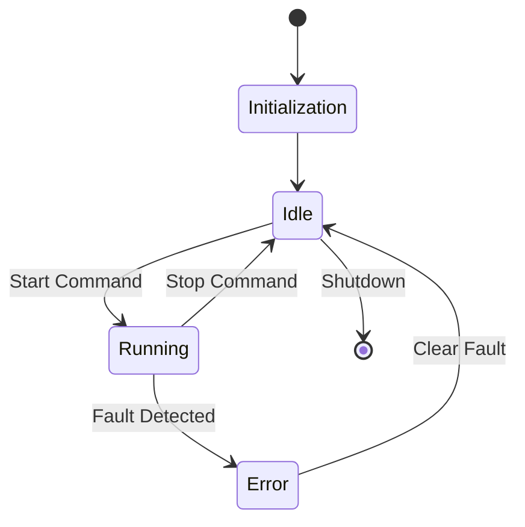
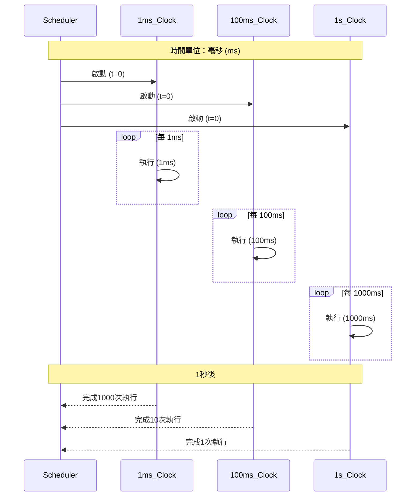

# 軟體架構設計文檔

## 1. 簡介
本文檔描述了基於ASPICE標準的軟體架構設計。

## 2. 系統概述
該系統是一個基於FreeRTOS的嵌入式系統,包含應用層、基礎軟體層和微控制器抽象層。

## 3. 架構概述
軟體架構分為三個主要層次:
1. Software (SWC)
2. Basic Software (BSW)
3. Microcontroller Abstraction Layer (MCAL)

## 4. 詳細架構設計
### 4.1 Software (SWC)
#### 4.1.1 Application
- Clock Source Config
- Apps Initialization
- PinIOs Sensing
- State Machine
- FreeRTOS Application
- Task And Schedule
- Main

### 4.2 Basic Software (BSW)
#### 4.2.1 Service
- UDS (Unified Diagnostic Services)
- FuSa (Functional Safety)
- Security

#### 4.2.2 Hardware Abstraction Layer (HAL)
- Clock Source Config
- PinIOs Sensing

#### 4.2.3 Operating System
- FreeRTOS

### 4.3 Microcontroller Abstraction Layer (MCAL)
#### 4.3.1 Drivers
- Clock Source Config
- PinIOs Sensing

## 5. 接口設計
在這個部分，我們將描述各主要模塊之間的接口。這些接口定義了模塊之間如何交互和通信。

### 5.1 應用層 (SWC) 與基礎軟體層 (BSW) 之間的接口

#### 5.1.1 應用層 -> UDS 服務
- 接口名稱: APP_UDS_Interface
- 功能: 允許應用層請求和接收診斷服務
- 方法:
  - `requestDiagnosticService(serviceID, data)`
  - `receiveDiagnosticResponse(responseData)`

#### 5.1.2 應用層 -> FuSa 服務
- 接口名稱: APP_FuSa_Interface
- 功能: 提供功能安全相關的服務
- 方法:
  - `performSafetyCheck()`
  - `reportSafetyStatus(status)`

#### 5.1.3 應用層 -> HAL
- 接口名稱: APP_HAL_Interface
- 功能: 允許應用層訪問硬體抽象層功能
- 方法:
  - `configureClockSource(frequency)`
  - `readPinState(pinID)`
  - `setPinState(pinID, state)`

### 5.2 基礎軟體層 (BSW) 與微控制器抽象層 (MCAL) 之間的接口

#### 5.2.1 HAL -> 驅動程序
- 接口名稱: HAL_Driver_Interface
- 功能: 允許HAL使用低級驅動程序功能
- 方法:
  - `initializeClockSource()`
  - `setClockFrequency(frequency)`
  - `configurePinMode(pinID, mode)`

### 5.3 操作系統 (FreeRTOS) 接口

#### 5.3.1 應用層 -> FreeRTOS
- 接口名稱: APP_RTOS_Interface
- 功能: 提供任務管理和調度功能
- 方法:
  - `createTask(taskFunction, priority)`
  - `deleteTask(taskHandle)`
  - `suspendTask(taskHandle)`
  - `resumeTask(taskHandle)`

## 6. 動態行為
這個部分描述系統的動態行為，包括狀態轉換、任務調度和重要的運行時序列。

### 6.1 系統啟動序列
1. 系統上電
2. 初始化MCAL驅動程序
3. 初始化HAL
4. 初始化BSW服務（UDS、FuSa、安全）
5. 初始化FreeRTOS
6. 創建和啟動應用層任務
7. 進入主循環

### 6.2 狀態機
應用層的主要狀態機：

### 6.3 任務調度
描述FreeRTOS中主要任務的調度策略：

1. 高優先級任務：中斷處理、安全關鍵操作
2. 中優先級任務：主應用邏輯、狀態機更新
3. 低優先級任務：後台操作、診斷、日誌記錄

### 6.4 關鍵場景
描述一些關鍵的運行時場景，例如：

#### 6.4.1 診斷請求處理
1. 外部診斷工具發送請求
2. UDS服務接收請求
3. 應用層處理診斷命令
4. 結果通過UDS服務返回
5. 外部診斷工具接收響應

#### 6.4.2 安全事件處理
1. FuSa服務檢測到安全相關事件
2. 通知應用層
3. 應用層切換到安全狀態
4. 執行必要的安全操作
5. 記錄事件詳情

### 6.5 定時圖
為關鍵操作提供定時圖，例如：
- 系統啟動時序
- 診斷請求處理時序
- 安全事件響應時序

## 7. 資源消耗

本節提供系統預估的資源消耗情況,包括記憶體使用和CPU負載。

### 7.1 記憶體使用

#### 7.1.1 靜態記憶體分配
- 程式碼空間: 預計 256 KB
- 全域變數: 預計 32 KB

#### 7.1.2 動態記憶體分配
- 堆(Heap): 配置 64 KB
- 棧(Stack): 每個任務配置 2 KB,共 5 個主要任務,總計 10 KB

#### 7.1.3 FreeRTOS 核心
- 預計使用 10 KB

總計記憶體使用: 約 372 KB

### 7.2 CPU 負載

基於前面描述的任務調度,我們可以預估 CPU 負載如下:

- 1ms Clock Task: 預計使用 5% CPU 時間
- 100ms Clock Task: 預計使用 2% CPU 時間
- 1s Clock Task: 預計使用 1% CPU 時間
- 主應用邏輯: 預計使用 50% CPU 時間
- RTOS 調度器開銷: 預計 10% CPU 時間
- 中斷處理和其他系統任務: 預計 12% CPU 時間

總計 CPU 使用率: 約 80%

註: 實際資源消耗可能會因具體實現和運行條件而有所不同。建議在開發過程中進行實際測量和優化。

## 8. 安全性和可靠性考慮

本節描述與功能安全(FuSa)和安全性(Security)相關的考慮。

### 8.1 功能安全(FuSa)考慮

1. 冗餘設計:
   - 關鍵感測器使用雙重讀取機制
   - 重要計算採用多版本編程方法

2. 故障檢測與處理:
   - 實現看門狗機制,定期檢查系統健康狀態
   - 設計安全狀態轉換機制,在檢測到故障時進入安全狀態

3. 實時性保證:
   - 使用 FreeRTOS 的優先級調度確保關鍵任務的實時響應
   - 實現任務執行時間監控,檢測任務超時情況

4. 記錄與診斷:
   - 實現安全日誌系統,記錄關鍵事件和錯誤
   - 提供診斷接口,支持故障分析和調試

### 8.2 安全性(Security)考慮

1. 通信安全:
   - 實現加密通信協議,保護數據傳輸
   - 使用安全的身份認證機制

2. 數據保護:
   - 敏感數據加密存儲
   - 實現安全的密鑰管理機制

3. 訪問控制:
   - 實現基於角色的訪問控制(RBAC)
   - 限制診斷和配置功能的訪問權限

4. 防禦機制:
   - 實現防止緩衝區溢出的安全編碼實踐
   - 設計抵抗 DoS 攻擊的機制

5. 更新與維護:
   - 實現安全的軟體更新機制
   - 提供安全的遠程診斷和維護接口

## 9. 可追溯性

本節建立軟體需求和架構元素之間的可追溯性關係。

| 需求ID | 需求描述 | 相關架構元素 | 驗證方法 |
|--------|----------|--------------|----------|
| REQ-001 | 系統應每1ms更新時鐘 | SWC.Application.ClockSourceConfig, MCAL.Drivers.ClockSourceConfig | 單元測試, 整合測試 |
| REQ-002 | 系統應支持統一診斷服務(UDS) | BSW.Service.UDS | 功能測試, 一致性測試 |
| REQ-003 | 系統應實現功能安全機制 | BSW.Service.FuSa | FMEA, 故障注入測試 |
| REQ-004 | 系統應具備安全通信能力 | BSW.Service.Security | 滲透測試, 安全審計 |
| REQ-005 | 系統應支持多任務並發執行 | BSW.OS.FreeRTOS | 壓力測試, 並發測試 |
| REQ-006 | 系統應能檢測並響應外部中斷 | MCAL.Drivers.PinIOsSensing | 中斷延遲測試 |
| REQ-007 | 系統應提供硬體抽象層 | BSW.HAL | 接口一致性測試 |
| REQ-008 | 系統應支持狀態機管理 | SWC.Application.StateMachine | 狀態轉換測試 |
| REQ-009 | 系統應保證關鍵任務的實時性 | BSW.OS.FreeRTOS, SWC.Application.TaskAndSchedule | 實時性分析, 時序測試 |
| REQ-010 | 系統應提供安全的更新機制 | BSW.Service.Security | 更新流程驗證, 安全性測試 |

註: 這個可追溯性矩陣提供了需求、架構元素和驗證方法之間的映射關係。在實際開發過程中,應根據具體的項目需求和架構設計進行詳細的擴展和完善。
