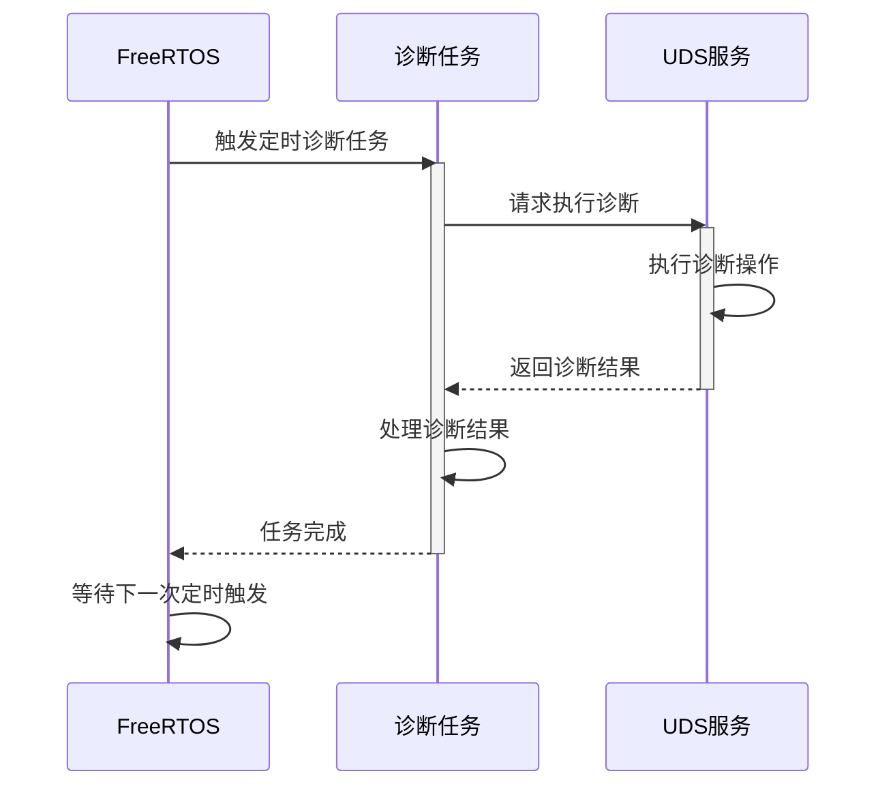
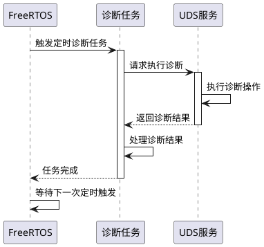

```mermaid
sequenceDiagram
    participant OS as FreeRTOS
    participant Task as 诊断任务
    participant UDS as UDS服务

    OS->>Task: 触发定时诊断任务
    activate Task
    
    Task->>UDS: 请求执行诊断
    activate UDS
    
    UDS->>UDS: 执行诊断操作
    
    UDS-->>Task: 返回诊断结果
    deactivate UDS
    
    Task->>Task: 处理诊断结果
    
    Task-->>OS: 任务完成
    deactivate Task

    OS->>OS: 等待下一次定时触发
```

```plantuml
@startuml
participant "FreeRTOS" as OS
participant "诊断任务" as Task
participant "UDS服务" as UDS

OS -> Task: 触发定时诊断任务
activate Task

Task -> UDS: 请求执行诊断
activate UDS

UDS -> UDS: 执行诊断操作

UDS --> Task: 返回诊断结果
deactivate UDS

Task -> Task: 处理诊断结果

Task --> OS: 任务完成
deactivate Task

OS -> OS: 等待下一次定时触发
@enduml
```
